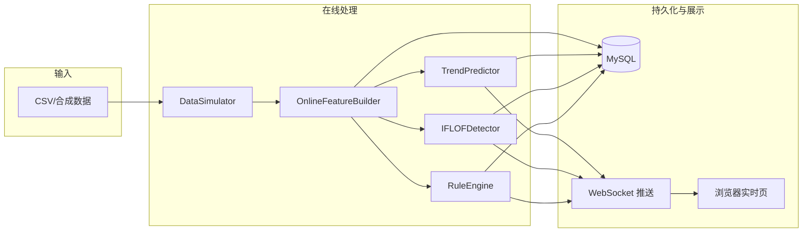

# 桥梁预应力张拉监测与异常识别系统 — 项目代码说明（论文写作参考）

> **文档用途**：在无法向大模型一次性上传完整仓库时，可将本文档按章节拆成多段上传，作为「项目背景、模块划分、数据流、参数与流程」的权威说明。  
> **安全提示**：数据库账号密码在 `config.py` 的 `DB_CONFIG` 中，**请勿**把含真实密码的配置提交到公开仓库或原样写入论文；论文中可写「本地 MySQL 配置」并略去敏感字段。

---

## 1. 项目概述

### 1.1 研究/工程目标

本毕业设计实现一套 **桥梁预应力张拉过程的在线监测与多源异常识别** 软件原型：

- 以 **左/右端张拉力、位移** 等时序数据为输入；
- 在线计算 **工程特征**（力、速率、刚度、滑动统计量等）；
- 融合三类检测手段：
  1. **规则引擎**（`rule_engine.py`）：面向明确工艺规程的阈值与状态机逻辑；
  2. **Isolation Forest + LOF**（`model_detector.py` + `train_IF_LOF_model.py`）：在无显式规则覆盖时，对「正常张拉模式」的统计偏离做辅助判断；
  3. **TCN 时序趋势预测**（`trend_predictor.py` + `train_tcn_trend_model.py`）：基于历史窗口预测下一步趋势，用 **预测残差** 发现短期规律异常。

同时提供 **Web 可视化**（实时曲线、预警列表、历史会话与详情复盘）与 **MySQL 持久化**。

### 1.2 技术栈摘要

| 层次 | 技术 |
|------|------|
| Web 服务 | Flask + Flask-SocketIO（线程模式） |
| 数据库 | MySQL（`pymysql` + `DictCursor`） |
| 前端 | Jinja2 模板 + Chart.js + 原生 JS |
| 机器学习 | scikit-learn（IF、LOF、StandardScaler）、PyTorch（TCN） |
| 数值计算 | NumPy、pandas（训练/数据处理脚本） |

### 1.3 仓库主要目录（与论文「系统结构」对应）

```
abnormal_recognition/
├── app.py                 # Flask 路由、WebSocket、张拉工作线程编排
├── config.py              # 全局参数：服务、数据库路径、规则阈值、特征列名等
├── database.py            # MySQL 建表、会话/数据点/异常 CRUD
├── feature_engine.py      # 在线特征与阶段（loading/holding/unloading）判定
├── rule_engine.py         # RuleEngine（实时检测）+ RealTimeTensionMonitor（离线标注/训练数据用）
├── model_detector.py      # IF+LOF 推理（fusion_model_bundle.pkl）
├── trend_predictor.py     # TCN 推理（tcn_trend_bundle.pkl）
├── data_simulator.py      # CSV 回放或合成张拉曲线
├── train_IF_LOF_model.py  # IF/LOF 训练脚本（输出 models/）
├── train_tcn_trend_model.py
├── IF_LOF_DATA.py         # IF/LOF 训练数据构建（调用规则引擎标注等）
├── TCN_DATA.py            # TCN 训练数据构建
├── templates/             # index / realtime / history / session_detail
├── static/js、static/css  # 前端逻辑与样式
├── models/                # 运行时模型产物（*.pkl），通常不入库或另附说明
├── data/                  # 模拟或实验 CSV（路径在 config 中配置）
└── process/               # 历史数据清洗、分类等辅助脚本（非在线服务必需）
```

---

## 2. 端到端数据流（核心流程）

### 2.1 单次「开始张拉」后的主线程逻辑（`app.py` → `_tension_worker`）

1. **创建会话**：`create_session(target_force)` 写入 `tension_sessions`，状态 `running`。
2. **初始化模块**（每轮张拉各一份实例，避免状态串会话）：
   - `DataSimulator`：按 `config.resolve_simulation_csv_path()` 决定是否读 CSV，否则合成三阶段数据；
   - `OnlineFeatureBuilder(window_size=10, target_force=...)`：逐点特征 + 阶段；
   - `IFLOFDetector()`：加载 `models/fusion_model_bundle.pkl`（若缺失则检测关闭）；
   - `TrendPredictor(model_dir="models")`：加载 `tcn_trend_bundle.pkl`；
   - `RuleEngine(target_force=...)`：规则检测与突降观察窗状态。
3. **循环**（`while tension_running`）：
   - `raw_point = simulator.next_point()` → `features = feature_builder.update(raw_point)`；
   - `rule_result = rule_monitor.check(features)`；
   - 若 `rule_monitor.consume_unloading_after_hold_drop()` 为真：`feature_builder.force_transition_to_unloading()`，使阶段与「持荷突降后判为卸载」一致；
   - **持荷稳定段统计**（用于会话结束摘要）：当 `phase == "holding"` 且 `holding_elapsed_time >= HOLDING_STABLE_MEDIAN_SKIP_S` 时，累积 `force_avg`、`total_delta_dis` 供中位数计算；
   - `insert_data_point(...)` 写入曲线点；
   - 规则告警 → `anomalies` 列表，`source=rule_engine`，`anomaly_type=alert["type"]`；
   - **仅 `phase == "loading"`** 时运行 IF/LOF 与 TCN（避免持荷/卸载阶段误用张拉阶段统计模型）；
   - 每条异常 `insert_anomaly`；
   - `socketio.emit("tension_data", emit_data)`，含本步 `anomalies` 及可选 `tcn_prediction`、`tcn_residual`；
   - `time.sleep(PUSH_INTERVAL)` 控制推送节奏（与 `config.PUSH_INTERVAL` 一致）。
4. **线程结束**：计算持荷段中位力、伸长、相对目标力偏差率等，调用 `finish_session(...)`；`emit("tension_complete", ...)`。

### 2.2 流程示意图（可放入论文）



---

## 3. 配置与关键参数（`config.py`）

论文中建议将参数分为：**服务与采集**、**阶段判定**、**规则阈值**、**特征列定义** 四类叙述。

### 3.1 服务、路径与采集（当前代码中的取值）

| 符号常量 | 当前取值 | 含义 |
|----------|----------|------|
| `FLASK_HOST` | `0.0.0.0` | 监听地址 |
| `FLASK_PORT` | `5000` | 端口 |
| `FLASK_DEBUG` | `True` | 调试模式（投产应改 `False`） |
| `DB_CONFIG` | 见 `config.py` | MySQL 连接（**论文勿写明文密码**） |
| `SIMULATION_CSV_FILENAME` | 见 `config.py` 中字符串 | 模拟 CSV；`None` 或文件不存在则用合成数据 |
| `REALTIME_CHART_MAX_POINTS` | `500` | 实时曲线保留点数 |
| `SAMPLE_INTERVAL` | `0.1` s | 采样/步长概念基准（注释与部分逻辑参照） |
| `PUSH_INTERVAL` | `0.1` s | 每处理一点后 `sleep`，控制 WebSocket 推送节奏 |
| `HOLDING_STABLE_MEDIAN_SKIP_S` | `50.0` s | 持荷开始后满该时长才参与「稳定段」中位数力/伸长统计（会话结束摘要） |
| `HOLDING_UNDER_OVER_JUDGE_DELAY_S` | `20.0` s | 进入持荷后满该时长才判欠张/超张/单端超张（避免刚进入持荷抖动） |

### 3.2 阶段判定（`PHASE_THRESHOLDS` + `PHASE_CONFIRM_COUNT`）

**阶段切换连续确认**：`PHASE_CONFIRM_COUNT = 3`（连续 3 次满足才切换 `loading` / `holding` / `unloading`，抑制噪声）。

| 键名 | 当前取值 | 含义（与 `feature_engine._update_phase` 一致） |
|------|----------|-----------------------------------------------|
| `loading_to_holding_ratio` | `0.98` | 平均力 \(F_{avg}\) / 目标力 \(F_{target} \ge 0.98\) → 主路径可进入持荷 |
| `holding_force_drop_ratio` | `0.90` | 已达目标进入的持荷：\(F_{avg}/F_{target} < 0.90\) 等条件配合可切卸载 |
| `unloading_rate_threshold` | `-5.0` | 平均力一阶差分 `force_rate`（kN/step）低于该值 → 卸载判据之一 |
| `min_holding_time_before_unloading_s` | `100.0` s | 持荷未满该时长，**不允许**仅凭掉力/速率切卸载，优先报突降类异常 |
| `under_tension_plateau_min_ratio` | `0.90` | 欠张路径：力达目标 90% 后才允许用「持平」判持荷 |
| `under_tension_plateau_force_rate_abs_max` | `8` kN | 相邻点 \(\|F_{avg,t}-F_{avg,t-1}\|\le 8\) 视为「持平」 |
| `under_tension_plateau_consecutive_min` | `30` 点 | 与下面时长取大，决定最少持平点数 |
| `under_tension_plateau_min_duration_s` | `2.5` s | 持平至少持续换算后的点数 |
| `under_tension_plateau_std_max` | `8.0` kN | 滑动窗内 \(F_{avg}\) 标准差须 \(\le\) 此值才认可持平 |
| `sub_target_holding_drop_from_peak` | `0.10` | 欠张持荷：相对持荷段峰值回落超过 10% 等 → 卸载判据 |

**说明**：`rule_engine.py` 顶部另有 `INITIAL_STAGE_RATIO=0.20`：平均力/目标力 \< 20% 时 **不** 做单步突降检测（避免起张抖动误报）。

### 3.3 规则检测阈值（`config.py` → `RuleEngine`，当前数值）

#### 3.3.1 力值带（目标力 \(F_t\) 为前端传入的 `target_force`）

| 参数 | 取值 | 判据公式（代码实现） |
|------|------|----------------------|
| `FORCE_LOWER_THRESHOLD` | `0.05` | 欠张（仅持荷且已过 `HOLDING_UNDER_OVER_JUDGE_DELAY_S`）：\(F_{avg} < F_t \times (1-0.05)\) |
| `FORCE_THRESHOLD` | `0.05` | 超张：\(F_{avg} > F_t \times (1+0.05)\)（张拉/持荷均可能触发超张侧） |
| `SIDE_FORCE_THRESHOLD` | `0.08` | 单端超张：\(\max(F_L,F_R) > F_t \times (1+0.08)\) |

#### 3.3.2 持荷阶段力值行为

| 参数 | 取值 | 判据说明 |
|------|------|----------|
| `HOLD_TIME_MIN` | `300` s | 最短持荷时间（在 `RealTimeTensionMonitor` 等离线汇总中使用；在线 `RuleEngine` 单点逻辑见代码） |
| `FORCE_FLUCTUATION` | `0.08` | 持荷且 \(F_{avg}\) 已在 \([F_t(1-0.05), F_t(1+0.05)]\) 内：若 \(\|F_{avg}-F_t\|/F_t > 0.08\) → `hold_fluctuation` |
| `FORCE_DROP_PERCENT` | `0.10` | **张拉**单步突降：\(\|ΔF_{avg}\|/F_t \ge 0.10\) → `force_drop_alarm`（critical）；`0.08\le \cdots <0.10` → `force_drop_warning` |
| `BROKEN_WIRE_DROP` | `0.08` | 单步下降比例 \(\ge 8\%\) 目标力 → 进入突降逻辑（张拉立即告警；持荷开 2s 观察窗） |

#### 3.3.3 持荷突降后观察窗（区分滑丝/断丝 vs 卸载回落）

| 参数 | 取值 | 判据说明 |
|------|------|----------|
| `FORCE_DROP_POST_CONFIRM_S` | `2.0` s | 持荷突降起算后观察窗长度 |
| `FORCE_DROP_STABLE_BAND_RATIO` | `0.012` | 窗内 \((F_{max}-F_{min})/F_t \le 0.012\) → 认为在突降后水平附近**平稳** |
| `FORCE_DROP_CONTINUE_RATIO` | `0.015` | 窗内相对突降锚点再降 \(\ge F_t\times 0.015\) → **持续下降**，置位请求切卸载（`consume_unloading_after_hold_drop`） |

#### 3.3.4 张拉阶段平均速率（kN/s）

特征：`loading_avg_rate_kn_s` = 近 `LOADING_SPEED_AVERAGE_WINDOW_S` 秒内 \((F_{avg}(t)-F_{avg}(t-W))/W\)（\(t-W\) 处力值线性插值）。

| 参数 | 取值 | 含义 |
|------|------|------|
| `LOADING_SPEED_AVERAGE_WINDOW_S` | `8.0` s | 平均速率窗口长度 |
| `SPEED_NORMAL_LOW` | `1.0` kN/s | 正常下限 |
| `SPEED_NORMAL_HIGH` | `14.0` kN/s | 正常上限 |
| `SPEED_SLOW_FACTOR` | `0.70` | 过慢阈值 = `1.0 × 0.70` = **0.70 kN/s** |
| `SPEED_FAST_FACTOR` | `1.30` | 过快阈值 = `14.0 × 1.30` = **18.2 kN/s** |
| `SPEED_CONSECUTIVE_LIMIT` | `3` | 连续 **3** 个点过慢/过快才报 `speed_too_slow` / `speed_too_fast` |

**速度突变**（在已满足「非持续快慢告警」时，与近期均值比）：

| 参数 | 取值 | 判据 |
|------|------|------|
| `SPEED_JUMP_REFERENCE_COUNT` | `3` | 取最近 3 个速率点的均值 `recent_avg` |
| `SPEED_SUDDEN_SLOW_RATIO` | `0.20` | 当前速率 `< recent_avg × 0.20` 计一次慢突变计数 |
| `SPEED_SUDDEN_FAST_RATIO` | `3.0` | 当前速率 `> recent_avg × 3.0` 计一次快突变计数 |
| `SPEED_JUMP_CONSECUTIVE_LIMIT` | `2` | 连续 **2** 次 → `speed_sudden_slow` / `speed_sudden_fast` |

#### 3.3.5 持荷左右不同步、刚度、卸载

| 参数 | 取值 | 判据（代码位置 `RuleEngine.check`） |
|------|------|-------------------------------------|
| `FORCE_IMBALANCE_RATIO` | `0.08` | 持荷：`force_diff_ratio > 0.08` → `force_imbalance`（特征中 `force_diff_ratio = \|F_L-F_R\|/F_{avg}`，见 `feature_engine`） |
| `FORCE_DIFF_ABS_MAX` | `100.0` kN | 持荷：`force_diff > 100` → `force_diff_excessive`（critical） |
| `RULE_SIDE_SPEED_DIFF_MAX` | `50.0` kN/step | 持荷：`force_rate_diff > 50` → `side_speed_unsync`；注释：当 `SAMPLE_INTERVAL=1s` 时量级接近 kN/s |
| `STIFFNESS_RATIO_MIN` | `5.0` | 张拉、`total_delta_dis > 1.0` mm：`stiffness_ratio < 5` → `low_stiffness` |
| `STIFFNESS_RATIO_MAX` | `200.0` | 张拉、同上：`stiffness_ratio > 200` → `high_stiffness` |
| `UNLOADING_RATE_MIN` | `-80.0` kN/step | 卸载：`force_rate < -80` → `unloading_too_fast` |

**持荷相对参考力的缓降**（与单步突降不同）：进入持荷后记录首参考力 `holding_reference_force`，若 \((F_{ref}-F_{avg})/F_{ref} > 0.10\)（即 `holding_force_drop_max`）→ `holding_force_drop`。

**说明**：`FORCE_IMBALANCE_MIN_KN`、`SIDE_SPEED_DIFF_RATIO`、`SIDE_IMBALANCE_*` 等更多用于 `RealTimeTensionMonitor`（离线标注），在线 `RuleEngine` 持荷力差主要用 **比例 + 绝对值** 如上。

### 3.4 特征列配置

- **`IF_LOF_FEATURE_COLS`**：`model_detector.py` 从特征字典按列名取向量；需与训练 bundle 内 `feature_cols` 一致。
- **`TCN_FEATURE_COLS`、`TCN_INPUT_WINDOW`**：`TCN_INPUT_WINDOW = 10`；`trend_predictor.feed_point` 内按目标力构造归一化向量，与训练列一致。

### 3.5 机器学习侧默认超参（训练脚本，便于论文「实验参数」）

**IF/LOF（`train_IF_LOF_model.py`）**：`IFOREST_N_ESTIMATORS=300`，`IFOREST_CONTAMINATION=0.01`，`LOF_CONTAMINATION=0.01`，`LOF_N_NEIGHBORS_RATIO=0.005`（邻居数=min(max(10, N×0.005), 50)），`WARNING_QUANTILE=0.95`，`ALARM_QUANTILE=0.99`，融合权重 IF:LOF = 0.5:0.5。

**TCN 训练（`train_tcn_trend_model.py`）**：`BATCH_SIZE=256`，`EPOCHS=80`，`LEARNING_RATE=1e-3`，`WEIGHT_DECAY=1e-5`，`NUM_CHANNELS=[64,64,32]`，`KERNEL_SIZE=5`，`DROPOUT=0.15` 等。

**在线 TCN 残差阈值（`trend_predictor.py` 加载 bundle 时的缺省）**：若 bundle 未带键，则 `warning_threshold=0.05`，`alarm_threshold=0.1`（归一化空间平均绝对残差）。

---

## 4. 异常判定方法与阈值详解（论文「检测准则」核心）

本节说明「**何时记为异常**、**阈值是多少**、**在代码哪一层**」。数值与 §3 一致；若你改过 `config.py`，以运行时代码为准。

### 4.1 总体策略：三层并行

| 层级 | 模块 | 启用阶段（`app.py`） | 判定思想 |
|------|------|----------------------|----------|
| A | `RuleEngine` | 全程 | 显式阈值 + 状态机（速度窗、力带、突降观察窗等） |
| B | `IFLOFDetector` | 仅 `phase=="loading"` | 特征经 `StandardScaler` 后，IF 与 LOF **同时**预测为异常（`predict==-1`）则 `is_anomaly=True` |
| C | `TrendPredictor` | 仅 `phase=="loading"` | 缓冲满 `seq_len` 步后做一步预测；**上一步预测**与**当前真实归一化目标**的平均绝对残差超过阈值则异常 |

### 4.2 规则引擎：按阶段列出（`rule_engine.RuleEngine.check`）

以下凡涉及 \(F_t\) 均指 `target_force`；\(F_{avg}\) 为左右平均力；`force_rate` 为相邻点平均力差分（kN/step）。

#### 4.2.1 全阶段：单步突降 `_process_step_force_drop`

1. 若 `phase=="unloading"` 或 \(F_{avg}/F_t < 0.2\)：不判突降（`INITIAL_STAGE_RATIO`）。
2. 计算相邻点 \(\Delta = F_{avg,curr}-F_{avg,prev}\)。若 \(\Delta\ge 0\)：无突降。
3. 令 `drop_ratio = |Δ|/F_t`。若 `drop_ratio < 0.08`（`BROKEN_WIRE_DROP`）：不触发。
4. **张拉阶段**：若 `drop_ratio ≥ 0.10` → `force_drop_alarm`（critical）；若 `0.08 ≤ drop_ratio < 0.10` → `force_drop_warning`（warning）。
5. **持荷阶段**：开启长度 `FORCE_DROP_POST_CONFIRM_S=2s` 的观察窗；窗满后若相对锚点继续下降满足 `FORCE_DROP_CONTINUE_RATIO` → 通知上层切卸载；否则若窗内起伏 `≤ FORCE_DROP_STABLE_BAND_RATIO×F_t` → `force_drop_alarm`（疑似断丝/滑丝平稳段）。

#### 4.2.2 张拉阶段 `loading`

- **超张/单端超张**：调用 `_check_force_magnitude_alerts(..., check_under=False)` → 即 \(F_{avg}>1.05F_t\) 或 \(\max(F_L,F_R)>1.08F_t\)；**不判欠张**。
- **快慢速**：见 §3.3.4；未满 8s 窗时 `loading_avg_rate_kn_s` 为 `None`，不判。
- **刚度比**：`stiffness_ratio = F_avg / total_delta_dis`（位移和很小时由特征引擎避免除零）；仅当 `total_delta_dis > 1.0` mm：`<5` 低刚度，`>200` 高刚度。

#### 4.2.3 持荷阶段 `holding`

- **左右力差**：`force_diff_ratio`（即 \(\|F_L-F_R\|/F_{avg}\)）`> 0.08` → `force_imbalance`；`force_diff > 100` kN → `force_diff_excessive`。
- **左右力变化率差**：`force_rate_diff > 50`（kN/step）→ `side_speed_unsync`。
- **欠张/超张/单端超张**：仅当 `holding_elapsed_time ≥ 20s` 才 `check_under=True` 判欠张。
- **相对进入持荷参考力的缓降**：相对下降比例 `> 0.10` → `holding_force_drop`。
- **波动**：仅当 \(F_{avg}\in[0.95F_t,1.05F_t]\) 时，若 \(|F_{avg}-F_t|/F_t > 0.08` → `hold_fluctuation`。

#### 4.2.4 卸载阶段 `unloading`

- `force_rate < -80` → `unloading_too_fast`；并重置 `holding_reference_force`。

### 4.3 IF + LOF：统计异常（`model_detector.py`）

- **输入**：由 `IF_LOF_FEATURE_COLS` 从当前 `features` 取向量 → `scaler.transform` → IF、LOF 的 `decision_function` / `predict`。
- **融合（在线）**：**仅当** `if_label==-1` **且** `lof_label==-1` 时 `is_anomaly=True`（双模型一致才报警，偏保守）。
- **写入库类型**：`source=if_lof`，`anomaly_type=statistical_anomaly`，`severity=warning`（见 `app.py`）。
- **无模型文件**：不报错，`is_anomaly` 恒为 `False`。

### 4.4 TCN：趋势残差异常（`trend_predictor.py`）

- **输入窗口**：默认最近 `TCN_INPUT_WINDOW=10` 步；每步特征为按 \(F_t\) 归一化后的多维向量，再经训练保存的 `input_scaler`。
- **残差**：用上一时刻模型给出的归一化预测第一步，与当前时刻实际归一化目标向量（`norm_force_avg` 等）算 **平均绝对误差** `residual`。
- **阈值**：优先读 `tcn_trend_bundle.pkl` 中的 `warning_threshold`、`alarm_threshold`；若缺失则 **0.05 / 0.1**。代码中：`residual > alarm` 或 `> warning` 均可置 `is_anomaly=True`（告警强度不同，见 `confidence`）。
- **写入库类型**：`source=tcn`，`anomaly_type=trend_anomaly`，`severity=warning`。

### 4.5 严重等级 `severity` 与「严重异常计数」

- 规则里：`speed_too_fast`、`over_tension`、`side_over_tension`、多数 `force_drop_alarm`、`holding_force_drop`、`hold_fluctuation`、`low_stiffness`、`force_diff_excessive` 等为 **critical**；其余多为 **warning**（以 `rule_engine` 各条 `alert` 为准）。
- `app.py` 对每条入库异常若 `severity.lower()=="critical"`：`critical_anomaly_count` 加一。

### 4.6 论文表述建议（一段话模板）

> 本系统采用「工艺规则 + 正常样本统计边界 + 时序预测残差」的组合策略：规则层在 `config.py` 中集中配置力值带（如 ±5% 目标力）、张拉平均速率窗（8 s）及快慢阈值（0.70～18.2 kN/s 等）、持荷波动（8%）与突降观察窗（2 s）等，由 `RuleEngine` 分阶段解析；张拉阶段在规则之外叠加 Isolation Forest 与 LOF 双一致判定及 TCN 残差阈值，以兼顾可解释性与对未知形态偏差的敏感性。

---

## 5. 数据库设计（`database.py`）

### 5.1 表 `tension_sessions`

记录一次张拉会话：开始/结束时间、目标力、状态、`total_points`、`anomaly_count`、`critical_anomaly_count`、持荷摘要（伸长 mm、中位力 kN、偏差率 %）等。新列通过 `_migrate_tension_sessions_columns` 对旧库增量添加。

### 5.2 表 `tension_data_points`

每采样点：`time_offset`、`force_left/right`、`force_avg`、`dis_left/right`、`total_delta_dis`、`phase`。外键 `session_id`，级联删除。

### 5.3 表 `tension_anomalies`

每条预警/警告：`time_offset`、`phase`、`source`（`rule_engine` / `if_lof` / `tcn`）、`anomaly_type`、`severity`、`detail` 文本、`force_avg`、`force_diff`。

**与前端对应**：历史详情页表格按 `source`、`anomaly_type`、`phase`、`severity` 筛选展示（见 `static/js/session_detail.js`）。

---

## 6. 核心模块说明（便于论文「模块设计」章节）

### 6.1 `feature_engine.py` — `OnlineFeatureBuilder`

- **输入**：`time, force_left, force_right, dis_left, dis_right`。
- **输出**：大字典，包含：
  - IF/LOF 用的力/位移/速率/加速度/刚度/滑动标准差等；
  - `loading_avg_rate_kn_s`：近 `LOADING_SPEED_AVERAGE_WINDOW_S` 秒的 **平均张拉速率**，供规则引擎与速度类规则使用；
  - `phase`、`holding_sub_target`、`holding_elapsed_time` 等辅助诊断字段。
- **阶段机**：`_update_phase` 结合 `PHASE_THRESHOLDS` 与连续确认；支持 `force_transition_to_unloading()` 供规则在「持荷突降后判卸载」时强制对齐阶段。

### 6.2 `rule_engine.py` — `RuleEngine`

- **接口**：`check(features_dict) -> {"has_anomaly": bool, "alerts": [...]}`，每条 alert 含 `type`、`severity`、`message`。
- **职责划分**（与训练脚本注释一致）：明确工程异常（超速、欠张、持荷掉力、两端不同步等）由规则覆盖；IF/LOF 为 **正常分布偏离**；TCN 为 **短期趋势残差**。
- **`consume_unloading_after_hold_drop()`**：若规则在持荷突降观察窗内判定为「卸载型回落」，返回真，`app.py` 调用 `feature_builder.force_transition_to_unloading()`。

**规则侧 `anomaly_type`（`type` 字段）汇总**（论文可放附录表）：

| type 值 | 典型含义（简述） |
|-----------|------------------|
| `speed_too_fast` / `speed_too_slow` | 平均张拉速率持续过快/过慢 |
| `speed_sudden_fast` / `speed_sudden_slow` | 速率突变 |
| `under_tension` / `over_tension` / `side_over_tension` | 欠张、平均超张、单端超张 |
| `force_drop_alarm` / `force_drop_warning` | 力值突降（含张拉立即与持荷分级） |
| `low_stiffness` / `high_stiffness` | 刚度比异常 |
| `force_imbalance` / `force_diff_excessive` | 左右力差或力差比 |
| `side_speed_unsync` | 左右速率不同步 |
| `holding_force_drop` / `hold_fluctuation` | 持荷段掉力、波动过大 |
| `unloading_too_fast` | 卸载过快 |
| `no_holding_stage` / `hold_time_insufficient` / `unload_not_finished` / `final_ok` | 多见于会话结束汇总类（`RealTimeTensionMonitor` 侧逻辑，与批量标注相关） |

*具体阈值与触发条件以 `rule_engine.py` 实现及 `config.py` 为准。*

### 6.3 `model_detector.py` — `IFLOFDetector`

- 优先加载 `fusion_model_bundle.pkl`（`iforest`、`lof`、`scaler`、`feature_cols`）。
- **融合策略（在线）**：`IsolationForest` 与 `LOF` 的 `predict` **均为异常（-1）** 时，`is_anomaly=True`（偏保守，降低单方误报）。
- 若模型文件缺失：返回全正常结构，不阻断主流程。

### 6.4 `trend_predictor.py` — `TrendPredictor`

- 网络结构：`CausalConv1d` → `TemporalBlock` 堆叠 → `TCNTrendModel` 预测未来多步。
- **缓冲区**：长度 `seq_len`（默认与 `TCN_INPUT_WINDOW` 一致），每步 `feed_point` 填入归一化特征向量。
- **`predict()`**：缓冲区未满返回 `None`；否则前向计算，将预测与 **上一步预测** 对比，在归一化空间算 **平均绝对残差**，与 bundle 中的 `warning_threshold`、`alarm_threshold` 比较得 `is_anomaly`。
- **`app.py` 中写入库的 `anomaly_type`**：`statistical_anomaly`（IF/LOF）、`trend_anomaly`（TCN）。

### 6.5 `data_simulator.py` — `DataSimulator`

- **CSV 模式**：`time` 列可为数值或日期时间字符串，内部统一为相对首行的秒偏移；列名 `force_left`、`force_right`、`dis_left`、`dis_right`。
- **合成模式**：生成加载—持荷—卸载三阶段简单曲线 + 噪声，用于无数据演示。

### 6.6 `app.py` — API 一览

| 方法路径 | 作用 |
|----------|------|
| `GET /` | 首页 |
| `GET /realtime` | 实时监测页（注入 `chart_max_points` 等） |
| `GET /history` | 历史会话列表 |
| `GET /history/<id>` | 会话详情（曲线 + 异常表） |
| `POST /api/start_tension` | JSON：`target_force`，启动工作线程 |
| `POST /api/stop_tension` | 停止标志 |
| `GET /api/history/sessions` | 会话列表 JSON |
| `GET /api/history/session/<id>` | 详情 JSON（session + data_points + anomalies） |
| `DELETE /api/history/session/<id>` | 删除会话（级联删点与异常） |

WebSocket 事件名：**`tension_data`**（每步）、**`tension_complete`**（结束汇总）。前端见 `static/js/realtime.js`。

---

## 7. 训练与离线数据管线（论文「模型训练」章节）

### 7.1 `train_IF_LOF_model.py`

- 从标注目录读取 `1_normal.csv` 等（脚本内 `CLASSIFIED_DIR` 常量，部署时需改为你的数据路径）。
- 流程概述：读入特征列 → 按 `CLIP_CONFIGS` 截断极端值 → `StandardScaler` → 训练 `IsolationForest`（`IFOREST_*`）与 `LocalOutlierFactor`（`LOF_*`）→ 保存 `fusion_model_bundle.pkl`（及训练脚本中定义的分位数阈值等，具体以保存逻辑为准）。
- **定位**：注释写明为「辅助异常评分」，不替代规则引擎的明确异常类型。

**注意**：脚本内 `FEATURE_COLS` 与 `config.IF_LOF_FEATURE_COLS` 必须与实际保存的 `feature_cols` 一致，否则推理会 `KeyError` 或维度错误。

### 7.2 `train_tcn_trend_model.py`

- 数据目录 `TCN_DATA_DIR`；超参如 `BATCH_SIZE`、`EPOCHS`、`LEARNING_RATE`、`NUM_CHANNELS`、`KERNEL_SIZE`、`DROPOUT`、早停等。
- 输出 `tcn_trend_bundle.pkl`：含 `model_state_dict`、`input_scaler`、`target_scaler`、`residual_stats`、阈值与 `input_window` 等。

### 7.3 `IF_LOF_DATA.py` / `TCN_DATA.py` / `process/*`

- 用于从原始张拉 CSV 或中间格式生成训练用窗口、标签或与规则一致的过滤逻辑。
- `RealTimeTensionMonitor` 在 `IF_LOF_DATA.py` 中被实例化，用于与线上一致的标注口径。

---

## 8. 前端页面与职责

| 页面 | 模板 | 脚本 | 要点 |
|------|------|------|------|
| 首页 | `index.html` | — | 导航入口 |
| 实时监测 | `realtime.html` | `realtime.js` | Socket.IO 订阅 `tension_data` / `tension_complete`；曲线与右侧预警列表 |
| 历史列表 | `history.html` | `history.js` | `GET /api/history/sessions`；跳转详情、删除 |
| 会话详情 | `session_detail.html` | `session_detail.js` | `GET /api/history/session/<id>`；Chart.js 双图；异常表多条件筛选 |

样式集中在 `static/css/style.css`。

---

## 9. 依赖环境（论文「实验环境」可写）

仓库根目录若未附带 `requirements.txt`，可根据 import 归纳：

- **Web**：Flask、flask-socketio  
- **数据库**：pymysql  
- **科学计算**：numpy、pandas  
- **传统 ML**：scikit-learn、joblib  
- **深度学习**：torch  

Python 版本建议与训练时一致（如 3.9–3.11），CUDA 可选（TCN 训练/推理可 CPU）。

---

## 10. 给论文撰写者的「分段上传」建议

若需投喂大模型，建议按下列顺序截取本文档：

1. **第 1–2 节**：背景与总流程；  
2. **第 3 节**：完整配置数值表；  
3. **第 4 节**：异常判定与阈值（论文核心，可单独成节）；  
4. **第 5–6 节**：数据库与模块设计；  
5. **第 7 节**：训练流程；  
6. **第 8–9 节**：前端与实验环境。

另可补充上传：**单文件源码**（如仅 `app.py` + `feature_engine.py`）配合对应章节，避免单次 token 超限。

---

## 11. 版本与一致性声明

- 本文档依据当前仓库源码整理；若你后续修改 `config` 阈值或特征列，请以代码为准并同步更新论文中的数字与表。  
- **`train_IF_LOF_model.py` 中 `CLASSIFIED_DIR`、`TCN_DATA_DIR` 等绝对路径** 多为本机数据位置，论文中可描述为「预处理后的训练样本目录」，不必粘贴真实路径。

---

*文档生成说明：本文件由代码仓库结构阅读与关键文件核对整理而成，用于毕业设计论文撰写与外部工具辅助阅读。*
